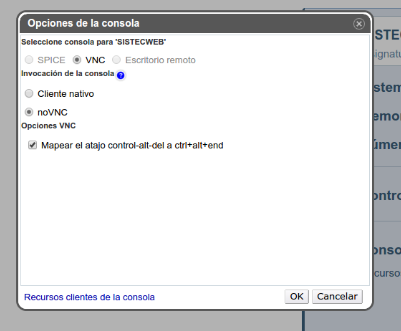

# Conversor de temperaturas implementado en IAAS.ULL.ES y añadido SINON.JS

En esta cuarta práctica incremental de la asignatura, haremos uso del servicio de [iaas.ull.es](http://iaas.ull.es/ovirt-engine/) y además incluiremos el uso de Sinon.js en los test.

En la rama "master" podrá encontrar todo el contenido de la práctica (ficheros, carpetas...), mientras que en la "gh-pages" los ficheros importantes del proyecto (html, css y js) han sido minimizados con Gulp con el fin de que el tiempo de carga de la web sea menor y por tanto, mas eficiente.

## Travis

## Karma

## Tutorial para el despliegue del proyecto en [IAAS.ULL.ES](http://iaas.ull.es/ovirt-engine/)

Una vez accedemos a la web de [iaas.ull.es](http://iaas.ull.es/ovirt-engine/) e iniciamos sesión con nuestra cuenta de la Universidad, nos encontramos con la máquina virtual que tenemos montada. En mi caso el nombre de la misma es "SISTECWEB-21". Antes de arrancarla, vamos al apartado "Modificar" y colocamos en las opciones de la consola "NoVNC" como podemos ver en la siguiente imagen:

Una vez hecho esto, ya podemos arrancar la máquina. Tras configurar la contraseña de la cuenta, procedemos a realizar un ssh desde la consola de nuestro ordenador para que nos sea más fácil trabajar. Para ello, usamos el siguiente comando y confirmamos con la contraseña que previamente hemos modificado:

<pre> ssh usuario@ip_maquina </pre>

Seguidamente, lo que haremos será crear el directorio .ssh en la maquina virtual y enviar nuestras claves para poder trabajar con Github. El comando para subir estos ficheros a la máquina es:

<pre> scp ~/.ssh/* usuario@ip_maquina:~/.ssh </pre>

Nos pedirá la contraseña y posteriormente, se subirán los ficheros.

Ahora lo que haremos será clonar el repositorio en la máquina virtual e instalar npm así como las dependecias del proyecto. Los comandos necesarios son:

<pre> git clone https://github.com/alu0100697414/pr4_STW.git </pre>
<pre> npm install </pre>
<pre> sudo apt-get install npm </pre>

Finalmente, solo nos queda ejecutar nodejs para ver desplegada nuestra aplicación Web. Para esto, vamos a la consola de la máquina virtual de forma online y ejecutamos el comando que vemos más abajo, de manera que se quede ejecutando la práctica en el servidor.

<pre> nodejs static-server.js </pre>

Para ver que todo funciona correctamente, accedemos al [enlace](http://10.6.128.79:8080/index.html).

## Datos de interés

- [Web de Github](http://alu0100697414.github.io/).
- [Web del repositorio de la práctica](https://github.com/alu0100697414/pr4_STW/tree/master).
- [Web de la práctica - IAAS](http://10.6.128.79:8080/index.html).
- [Web del recubrimiento (blanket)](http://10.6.128.79:8080/test/test_blanket.html).
- [Web de Travis](https://travis-ci.org/alu0100697414/pr4_STW).
- [Guía docente de la asignatura](http://eguia.ull.es/etsii/query.php?codigo=139264512).
- Contacto: alu0100697414@ull.edu.es
