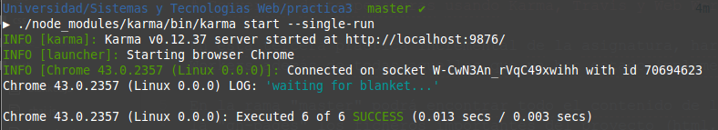

# Conversor de temperaturas usando Karma, Travis y Web Workers.

En esta tercera práctica incremental de la asignatura, haremos uso de las herramientas Karma, Travis y Web Workers.

En la rama "master" podrá encontrar todo el contenido de la práctica (ficheros, carpetas...), mientras que en la "gh-pages" los ficheros importantes del proyecto (html, css y js) han sido minimizados con Gulp con el fin de que el tiempo de carga de la web sea menor y por tanto, mas eficiente.

## Travis

## Karma

## Datos de interés

- [Web de Github](http://alu0100697414.github.io/).
- [Web del repositorio de la práctica](https://github.com/alu0100697414/pr3_STW/tree/master).
- [Web de la práctica](http://alu0100697414.github.io/pr3_STW/).
- [Web del recubrimiento (blanket)](http://alu0100697414.github.io/pr3_STW/test/test_blanket.html).
- [Web de Travis](https://travis-ci.org/alu0100697414/pr3_STW).
- [Guía docente de la asignatura](http://eguia.ull.es/etsii/query.php?codigo=139264512).
- Contacto: alu0100697414@ull.edu.es
